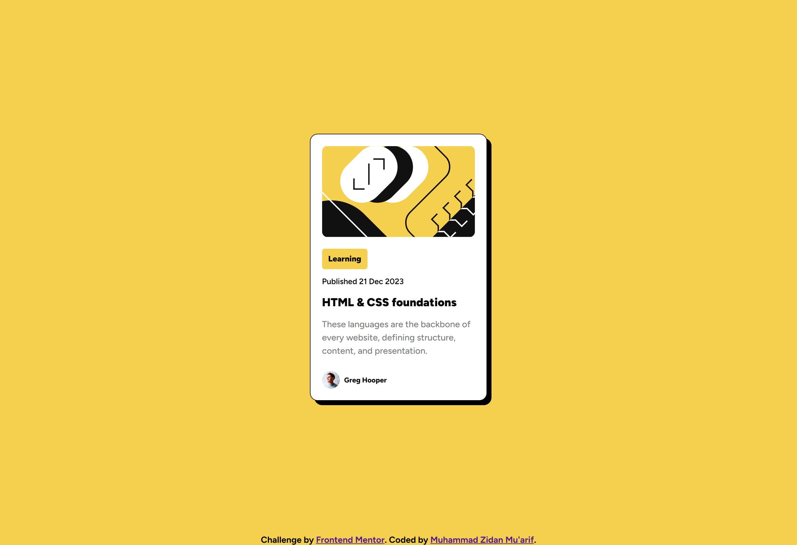
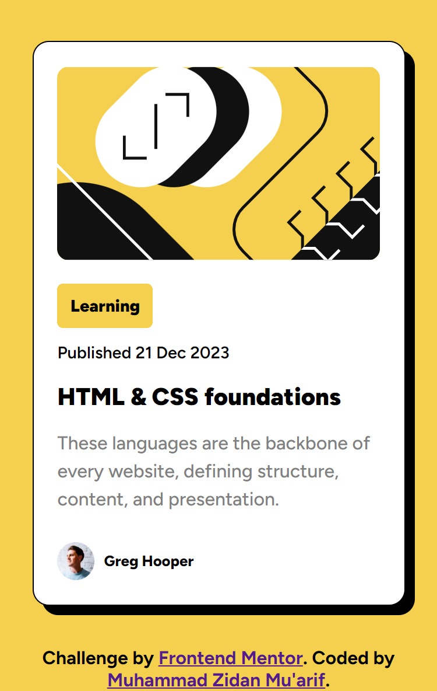

# Frontend Mentor - Blog preview card

## Welcome! 👋

This is a solution to the [Blog preview card challenge on Frontend Mentor](https://www.frontendmentor.io/challenges/blog-preview-card-ckPaj01IcS). Frontend Mentor challenges help you improve your coding skills by building realistic projects. 

## Table of contents

- [Overview](#overview)
  - [The challenge](#the-challenge)
  - [Screenshot](#screenshot)
  - [Links](#links)
- [My process](#my-process)
  - [Built with](#built-with)
- [Author](#author)

## Overview

### The challenge

Users should be able to:

- See hover and focus states for all interactive elements on the page

### Screenshot

### Links

- Solution URL: [Here]()
- Live Site URL: [Here](https://zidannn24.github.io/FM-Blog-preview-card/)

## My process

### Built with

- Semantic HTML5 markup
- CSS
- Flexbox

## Author

- Frontend Mentor - [@zidannn24](https://www.frontendmentor.io/profile/zidannn24)
- Github - [@zidannn24](https://github.com/zidannn24)